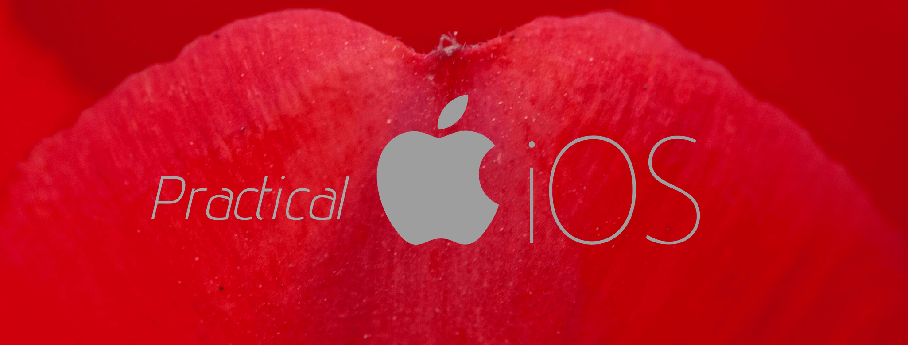

# Practical iOS

- A list of my practicing with iOS tutorials, libraries, videos and articles. 

- Coming soon...

### Find me on:

- GitHub [/duonghominhhuy](https://github.com/duonghominhhuy)
- Twitter [@duonghominhhuy](https://twitter.com/duonghominhhuy)
- Find more Practical topics on [Practical List](https://github.com/duonghominhhuy/practical-list)

