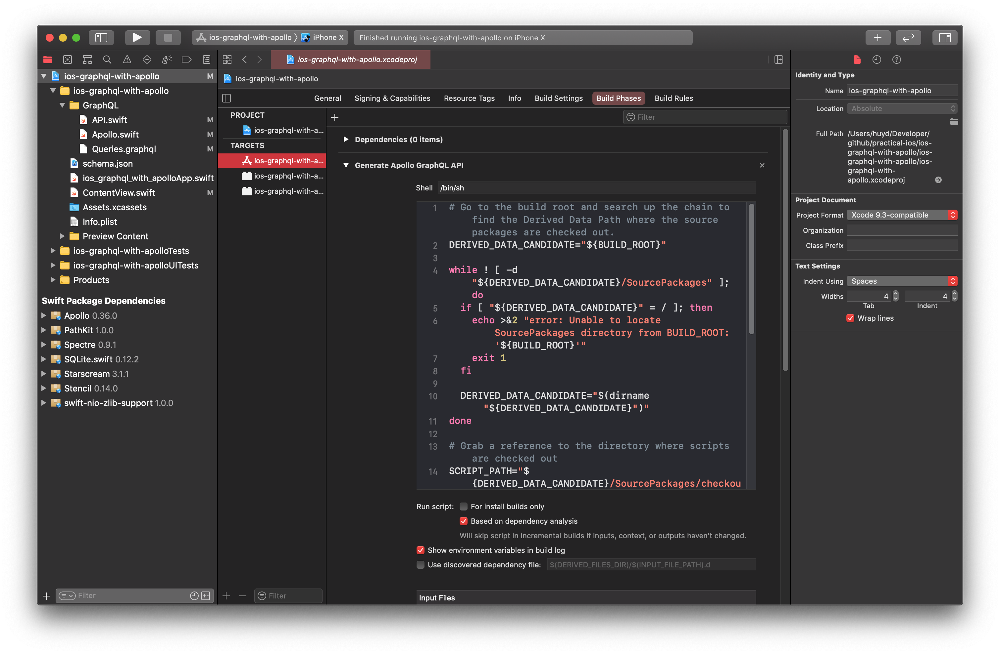

# iOS - GraphQL with Apollo

- Video by Brian Advent on [YouTube](https://youtu.be/YoKlTbYdFPs)

### Preview

<p align="middle">
      
</p>

### Features

- SwiftUI 2.0 & Xcode 12.1.
- GraphQL, Apollo GraphQL.

### Steps

1. Create SwiftUI project.
2. Add the Apollo framework (Swift Package Manager): `https://github.com/apollographql/apollo-ios.git`
3. Install apollo-cli: `brew install apollo-cli`
4. Download a schema & copy into project: `apollo schema:download --endpoint=https://countries.trevorblades.com/ schema.json`
5. Create GraphQL folder: Apollo.swift, Queries.graphql.
6. Add a code generation build step (Swift Package Manager): `https://www.apollographql.com/docs/ios/installation/#adding-a-code-generation-build-step`
7. Build your target in Xcode to verify that the schema.json.
8. Add the generated API.swift file to GraphQL folder.
9. Add ApolloClient in Apollo.swift:
```swift
class Network {
    static let shared = Network()
    lazy var apollo = ApolloClient(url: URL(string: "https://countries.trevorblades.com/")!)
}
```
10. Use GraphQL in ContentView.swift:
```swift
struct ContentView: View {
    
    @State var countryEmoji = ""
    
    var body: some View {
        Text(countryEmoji)
            .padding()
            .onAppear(perform: {
                Network.shared.apollo.fetch(query: SpecificCountryQuery()) { result in
                    switch result {
                    case .success(let graphqlResult):
                        if let emoji = graphqlResult.data?.country?.emoji {
                            self.countryEmoji = emoji
                        }
                    case .failure(let error):
                        print("Error: \(error)")
                    }
                }
            })
    }
}
```

### Find me on:

- [GitHub](https://github.com/duonghominhhuy) and [Twitter](https://twitter.com/duonghominhhuy)
- Find more iOS apps on [Practical iOS](https://github.com/duonghominhhuy/practical-ios)
